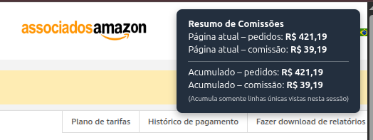

# Amazon Afiliados – Calculadora Automática de Comissão  
Extensão para Google Chrome

Uma extensão simples e eficiente que calcula automaticamente o valor total dos pedidos e a comissão estimada no painel de Afiliados da Amazon Brasil.  
Desenvolvida originalmente para facilitar a vida do glorioso Zé Bunda 🐦🤖✨

---

---

## 🖼️ Preview da Extensão

A extensão adiciona automaticamente um pequeno painel no canto superior direito da tela mostrando:

- Total da página atual  
- Comissão da página atual  
- **Total acumulado entre páginas**  
- **Comissão acumulada entre páginas**

Exemplo real do funcionamento:

*(adicione `screenshot.png` no repositório conforme o print que quiser usar)*

---

## 📌 Funcionalidades
- Lê automaticamente a tabela de pedidos no painel da Amazon Afiliados.  
- Identifica cada categoria e aplica a porcentagem correta.  
- Soma automaticamente:
  - **O total da página atual**, e  
  - **Um acumulado geral entre páginas visitadas na sessão**.  
- **Evita duplicações**: se você voltar para uma página já visitada, ela **não é somada novamente** ao acumulado.  
- Perfeito para navegar página por página e obter um total geral confiável.  
- Atualiza automaticamente quando:
  - a paginação muda,  
  - filtros são aplicados,  
  - a tabela recarrega via AJAX.  
- 100% local, sem enviar dados para nenhum servidor.  
- Manifest V3 compatível.

---

## 🔒 Segurança e Conformidade com a Amazon

Esta extensão é totalmente segura e não infringe nenhuma política da Amazon.

### ✔️ O que ela faz
- Lê apenas informações **já exibidas na tela**.  
- Processa tudo **localmente**, sem comunicação externa.  
- Exibe um painel com cálculos da sessão.

### ❌ O que ela NÃO faz
- Não coleta, armazena ou envia dados.  
- Não altera o funcionamento da Amazon.  
- Não automatiza cliques ou ações.  
- Não interfere no programa de afiliados.  
- Não modifica links, cookies ou pedidos.

### 🟢 Conclusão
O comportamento é equivalente a você usar uma calculadora enquanto navega.

---

## 🚀 Instalação (Modo Desenvolvedor)
1. Baixe ou clone este repositório.  
2. Abra Chrome e acesse: `chrome://extensions/`  
3. Ative o **Modo desenvolvedor**.  
4. Clique em **Carregar sem compactação / Load unpacked**.  
5. Selecione a pasta da extensão.  
6. Abra o painel da Amazon Afiliados — o cálculo aparecerá automaticamente.

---

## 🛠 Arquivos
- `manifest.json` – configuração  
- `content.js` – lógica de leitura, cálculo e acúmulo entre páginas  

---

## 📘 Como funciona
1. O script identifica a tabela.  
2. Extrai categoria e preço de cada item.  
3. Calcula o total da **página atual**.  
4. Cria uma chave única para cada linha e mantém um conjunto de linhas já vistas.  
5. Soma para o **acumulado global** apenas as linhas ainda não vistas.  
6. Recalcula tudo sempre que a tabela da página muda.

---

## 🧪 Melhorias Futuras
- Botão para **resetar o acumulado** sem precisar atualizar a página  
- Coluna extra com comissão por item  
- Exportação CSV/Excel  
- Tema escuro do painel  

---

## 📜 Licença – MIT
Este projeto está licenciado sob a **MIT License**, permitindo uso, cópia, modificação e distribuição livremente.  
Consulte o arquivo `LICENSE` para mais detalhes.

---

# 🇺🇸 English Version

# Amazon Affiliates – Automatic Commission Calculator  
Chrome Extension

A simple and efficient extension that automatically calculates the order total and estimated commission in the Amazon Brazil Affiliates dashboard.  
Originally created to help the mighty Zé Bunda 🐦🤖✨

---

---

## 🖼️ Extension Preview

The extension displays a floating panel showing:

- Current page total  
- Current page commission  
- **Accumulated total across pages**  
- **Accumulated commission across pages**  

---

## 📌 Features
- Automatically reads the Amazon Affiliates order table.  
- Calculates current page values.  
- **Accumulates totals across visited pages** during the session.  
- **Prevents duplication** when revisiting pages.  
- Reactively updates when filters or pagination change.  
- Fully local, no external communication.  
- Manifest V3 compatible.

---

## 🔒 Safety and Amazon Compliance
This extension is safe and compliant.

It does **not** collect data, store information, alter Amazon functionality, automate actions, or interfere with affiliate links.

It simply processes what is already visible on the screen.

---

## 📜 License – MIT
Licensed under the MIT License. See `LICENSE` for details.

